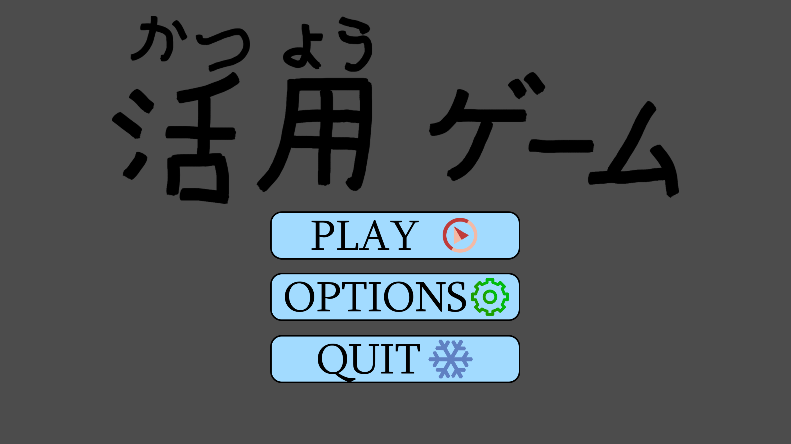
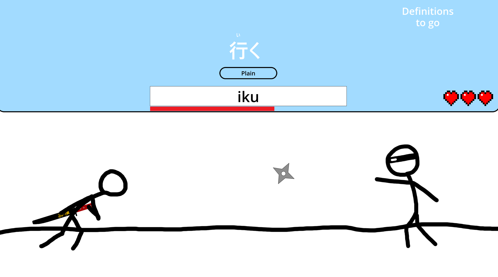
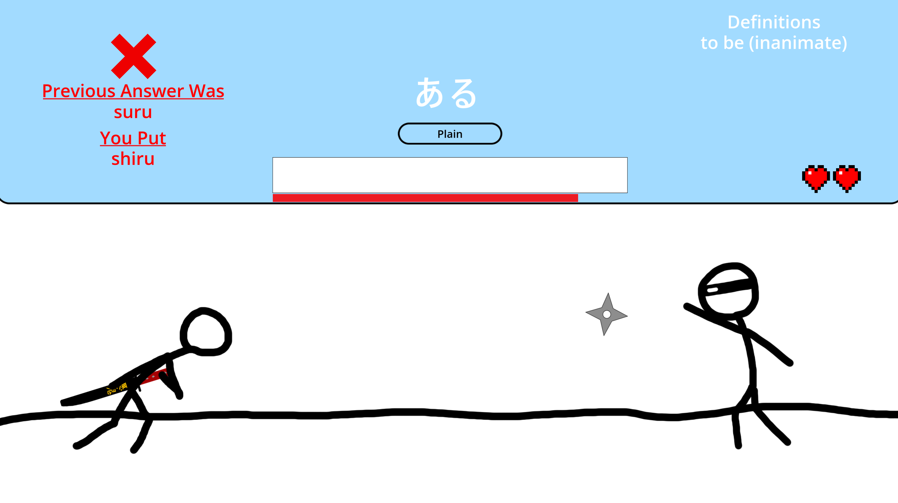

# Japanese-Conjugation-Game

# Basics
## Main Menu

- Settings to change how long you can spend per word
- Include uncommon irregular godan verbs

## Level Menu

- Level unlock once the previous level is cleared 
- In the order of Genki 5 + 4 and other Japanese grammar books
- More verb conjugations and adjective conjugations on pages 2 + 3

## Level

Type the word and the conjugations it wants

Typing incorrectly leads
- -1 life
- +5 seconds on the next word
- Puts it at the end of the list of the level
- Shows the correct spelling
